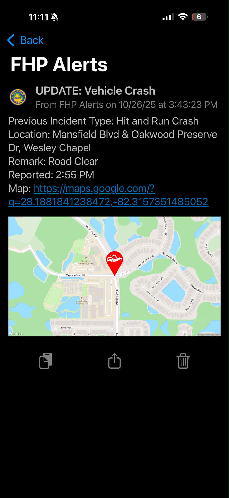

A real-time notification system that monitors the Florida Highway Patrol Live Traffic Crash and Road Condition Report source code for all incidents across Florida. It delivers alerts with location, remarks, and report time, logs all CAD calls, and provides follow-up notifications for updated incident types while showing previous incident types, locations and remarks. The system also generates and delivers Mapbox static maps, standardizes location data and generates Google Maps links for precise clickable incident locations. *This system is an independent project and is not affiliated with or endorsed by the Florida Highway Patrol (FHP).*

  
  
  

 

  
  

# Running the Script

To run this script, first install Python, ensuring that you check the
box labeled "Add Python to PATH" during installation. After installation,
open the Command Prompt and enter the following commands one at a
time: 

1. `pip install requests`Press Enter and wait for the installation
to complete.
2. `pip install beautifulsoup4`Press Enter again and wait
until the installation finishes.
3. `pip install pillow`Press Enter once
more and wait for the installation to finish.

The Pillow library is
required for handling image generation and map rendering.

Once all required libraries have been installed, open the script in
Notepad (or any text editor) and configure it according to your
preferences. Make sure to enter your **Pushover User Key** and **API
Token** in the designated fields.

When configuration is complete, return to the Command Prompt, navigate
to the folder containing the script, and run it by
typing:`python FHP_Traffic_Notifier_V2.py`

If you want the **county name** to appear in the location (after the
city), you can toggle this feature using the `ADD_COUNTY_TO_LOCATION`
setting in the script. Set this value to **True** if you want counties included, or **False**
if you prefer them hidden. 

*Example: **True** = 123 Main St, Lakeland, Polk County. **False** = 123 Main St, Lakeland*

# Getting Started with Notifications

To begin receiving notifications on your phone, download the
[**Pushover**](https://pushover.net/) application and create an account.
Once your account is set up, you will receive both a **User Key** and an
**API Token**. These credentials must be entered into the script under `PUSHOVER_USER_KEY` and `PUSHOVER_API_TOKEN` to
enable notifications.

# Mapbox Static Map Images

If you want to include static map images in your notifications, you will
need a **Mapbox Access Token**. You can obtain this by signing up for a
free account at [Mapbox](https://www.mapbox.com/). Once you have your
token, enter it into `MAPBOX_TOKEN`.

The use of Mapbox static images can be **enabled or disabled** depending
on your preference. This option is controlled in the configuration
section of the script under `GENERATE_MAPBOX_MAP`, and by default, it is
set to **True**. If you choose to enable static maps, make sure that the
**Map Pins** folder is downloaded and placed in the same directory as
the script. This folder contains the necessary icon files that are
displayed on the maps. Without it, the pin markers will not appear and
the map will be blank.

The pin size displayed on the static maps can be adjusted using the
`PIN_SIZE` variable in the script. By default, the pin size is set to
**300**, but you can increase or decrease this value depending on your
preferred visual scale.

# Filtering Notifications

To filter notifications by county, edit the `FILTERED_COUNTIES` section.
Include only the counties from which you wish to receive
notifications. For example, to receive notifications exclusively for
Pasco County, you would enter:`[Pasco]`

This process differs from filtering incident types. To exclude specific
incident types, list them in the `FILTERED_INCIDENTS` section. The names
must match exactly as they appear on the official FHP page for the
filter to work properly. For example, if you do not wish to receive
notifications for Vehicle Crashes that involve no injuries or
roadblocks, enter:`[Vehicle Crash]`

**Note:** If an incident updates to a type that is not filtered, you
will still receive the update notification, which will include the
previous incident type.

# Road Mapping

If you want abbreviated road names to display as their full versions in
notifications, edit the `HIGHWAY_NAMES` section. For example, to display
"US-19" as "US Highway 19," you would 
enter:`'US-19': 'US Highway 19'`Additional mappings should be added
after a comma.

# Important Note

Not all locations will display perfectly. While most are formatted
correctly, some may appear partially incorrect if the FHP report
contains inconsistent or improperly formatted data. If you notice
recurring errors within your subscribed county, you can correct them
manually within the `CLEAN_WEB_ADDRESS` section.
